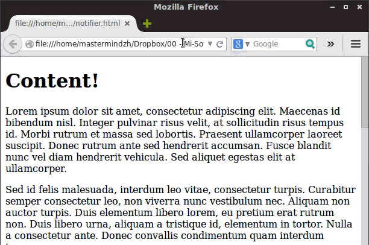
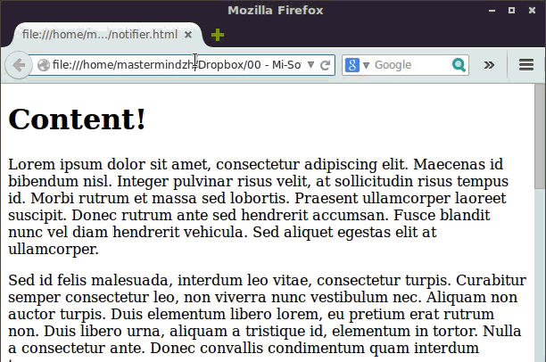
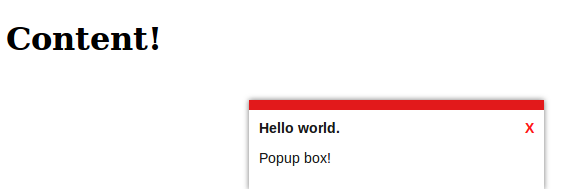
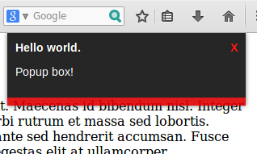
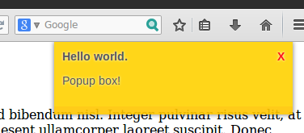

#Simple Notification System
A simple notification system built to be light yet functional.

Use the Table of contents for quick navigation around this readme file.

<ul>
	<li><a href = "#class_options">class_options</a></li>
    <li><a href = "#required">Required steps</a></li>
    <li><a href = "#nophp">Usage without php</a></li>
    <li><a href = "#usagephp">Usage with php</a></li>
    <li><a href = "#animation">Animations</a></li>
    <li><a href = "#screenshots">Screenshots</a></li>
</ul>

<a name = "class_options"></a>
##Class options
These are all the options provided by default in the SNS. Have a look at the "Usage" part of this readme to find out how to apply these classes.

<table>
	<tr>
		<th>Class</th>
        <th>Function</th>
    </tr>
    <tr>
    	<td>topleft</td>
        <td>Use this class if you want the popup on the top left</td>
    </tr>
    <tr>
    	<td>topright</td>
        <td>Use this class if you want the popup on the top right</td>
    </tr>
    <tr>
    	<td>botleft</td>
        <td>Use this class if you want the popup on the bottom left</td>
    </tr>
    <tr>
    	<td>botright</td>
        <td>Use this class if you want the popup on the bottom right</td>
    </tr>
    <tr>
    	<td>flip</td>
        <td>flip will flip the border from top to bottom, usefull for when you your popup on the top of the page</td>
    </tr>
    <tr>
    	<td>edged</td>
        <td>edged will remove the margin and stick it to the bottom / top </td>
    </tr>
     <tr>
    	<td>lightshadow</td>
        <td>Replaces the default (black) shadow with a white one, perfect for dark backgrounds! </td>
    </tr>
      <tr>
    	<td>blackred</td>
        <td>Default black &amp; red theme </td>
    </tr>
      <tr>
    	<td>whitered</td>
        <td>Default white &amp; red theme </td>
    </tr>
</table>

<a name = "required"></a>
##required steps
To make SNS work you have to add 2 bits of code apart from the actual content div. These should be included on every page with a popup.
One being the link to the css (for best performance you could include the css code in your own stylesheet).
We can add the css as follows:<br />
`<link rel='stylesheet' href='./notifier.css' type='text/css' />`<br />
We will also need to have a jQuery script to start the animation. Examples of these can be found under: <a href = "#animation">Animations</a><br />
The default script would be as follows:<br />
`<script>$('#notifier').slideDown('slow').delay(5000).slideUp('slow');</script>`<br />

You should add the jQuery to the very bottom of the page, right before the end `</body>` tag.

<a name = "nophp"></a>
##Usage without php
Using SNS without php requires you to write the html code yourself, this is fine if you want to have a single or very few popups. If you want to have a side-wide solution I suggest you go to "<a href = "#usagephp">Usage with php</a>"

To use SNS without php you will have to dig in the css file.
Let's have a look at notifier.css, in notifier.css you'll find 2 themes (blackred & whitered). These themes are examples upon which you can build yourself.
After you've created a css class with your own style (or if you want to use one of the provided themes) we can continue on to the html code.

The popup window will be constructed using a "div", for this explanation we will use the id "notifier" (we will require the id later). The div also requires the class "notifier". For now you should have the following code:
```
<div id="notifier" class = "notifier"><a onclick="document.getElementById('notifier').style.display='none';return false;" href="#" id="close">
X</a>
    <b>Hello world.</b>
    <p>
       Popup box!
    </p>
</div>
```
As you can see, I've added a "close" button and some text to the div.

Now we will have to add more "<a href = "#class_options">class_options</a>".
To do this edit the piece of code that says:
<br />
`<div id="notifier" class = "notifier">`<br />
to include the new classes like so:
<br />`<div id="notifier" class = "notifier whitered botright edged">`<br />
In this example the popup will appear in the bottom right and will be stuck to the browsers bottom. (<a href = "#s1">screenshot 1)</a>
`<?php include('sns.php');?>`
Now open up your footer include file and add this line of jQuery:
`<script>$('#notifier').slideDown('slow').delay(5000).slideUp('slow');</script>`
The preparations are now done. You can now simply call a popup from any page with:
`<?php  popUp("notifier botright whitred edged", "Testtext");?>`
Of course you need to replace the parameters to adjust it to your sites look and feel.


<a name = "usagephp"></a>
##Usage with php
If you want to use a popup on many pages I suggest going with this solution.
I will make the assumption that you already have an included footer and header.

To start, place the sns.php file somewhere in your project.
Open up your header include file and add the following line:


<a name = "animation"></a>
##Animation
There are many animations you can do with jQuery, I will be supplying you with 2 of them.
<p>**fadein and fadeout:**</p>
`<script>$('#notifier').fadeIn('slow').delay(5000).fadeOut('slow');</script>`

<p>**Slide in and slide out:**</p>
`<script>$('#notifier').slideDown('slow').delay(5000).slideUp('slow');</script>`

<p>Both examples have a 5000ms delay.</p>

<a name = "Screenshots"></a>
##Screenshots
<a name = "s1"></a>




